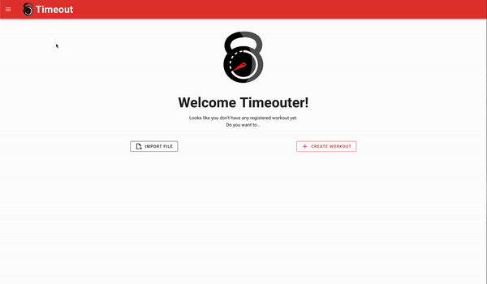

# Timeout

## Presentation


The end goal is to have a lightweight application, only running on the browser
to create and launch customs workouts. A workout is composed of several small physical exercise 
that you can do without any equipment.

### What's missing
- [X] Workout listing and detail pages
- [X] Exercises list and filter by tags
- [X] Complete edition of a workout: exercise order, duration, etc
- [ ] Keep state and local storage in sync to avoid losing your work on page reload
- [ ] File upload and download module, to transfer your created workouts anywhere
- [ ] Launch a workout to make it run exercise by exercise with a timer so you can follow along
- [ ] More exercises to chose from
- [ ] Mobile friendly
- [ ] Major upgrade of dependencies (it's been a loooong time since I've worked on this, and it shows)

### Notes
This is a pet project that I have very rarely, if ever, the time to work on.
I probably won't work on it again myself because of that but any contribution is very much welcome!

## Project setup
```
npm install
```

### Compiles and hot-reloads for development
```
npm run serve
```

### Compiles and minifies for production
```
npm run build
```

### Lints and fixes files
```
npm run lint
```

### Customize configuration
See [Configuration Reference](https://cli.vuejs.org/config/).
